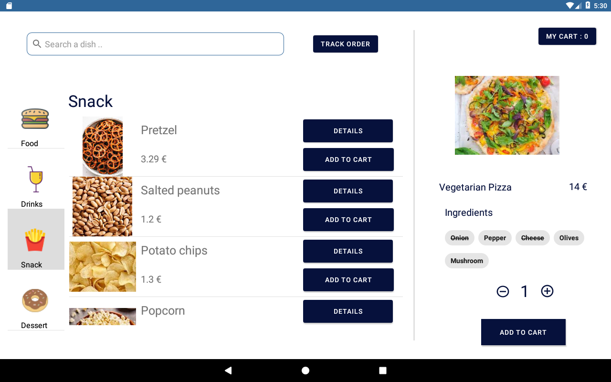

Realised by: Karim Frem, Putian Yuan, Salma Chana

## Implemented functionnalities :

Fast and easy order
Browse the items and check their details
Search for items / or ingredients
Detailed description 
Interaction less ordering
Customizable orders (before and after adding it to cart)
Add special note to the order (could help to differentiate between orders and incase of food allergies with ingredients the user can not change)

## Code organisation :

Our application is composed of one Main Activity that interacts with our views: 
navigation tool to choose the food category
menu list to show all items belonging to a category
details view to show detail of a single item
order track view to show the order track
cart view to show the items added to the cart
These views interact with a data manager to get and store data in a local JSON file. The input is defined by the user actions (search bar, button press).

## The interface :

